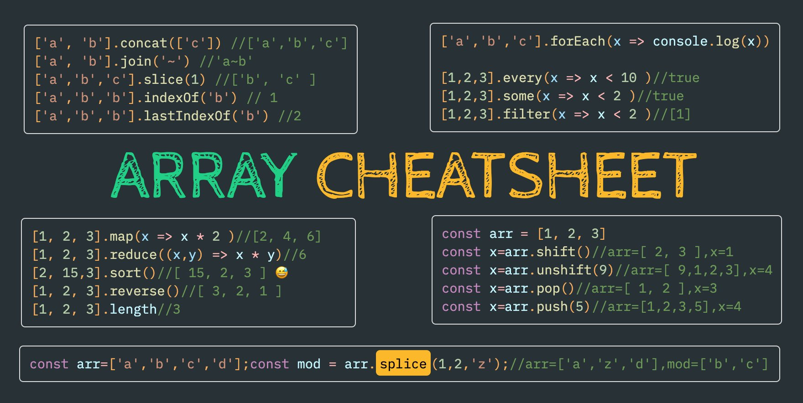
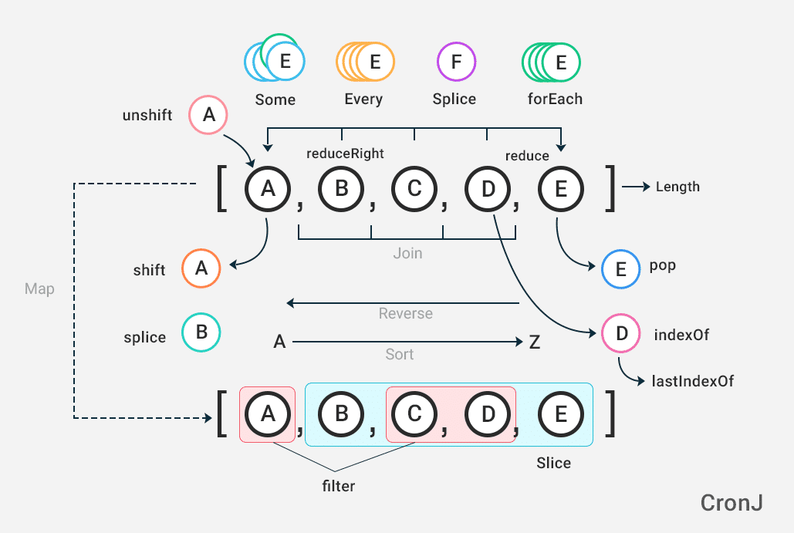
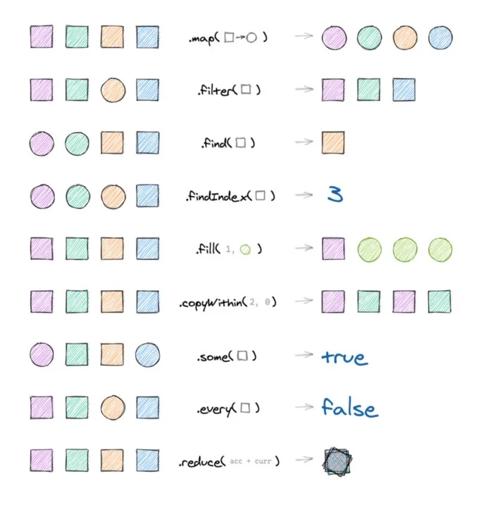

<h1 align="center">
<br></br>
       Array
<br></br>
</h1>
 


[](https://github.com/clarethe) [](https://github.com/clarethe?tab=followers)

The JavaScript Array class is a global object that is used in the construction of arrays; which are high-level, list-like objects and access them by a single variable.


## Create an Array

```
let fruits = ["Apple", "Banana"]
```

## To add/remove elements:


**`push(...items)`**  - adds items to the end

```
let newLength = fruits.push("Orange")    // ["Apple", "Banana", "Orange"]
```

**`pop()`** -  remove an item from the end

```
let last = fruits.pop() // ["Apple"]
```

**`shift()`**  - remove an item from the beggining

```
let first = fruits.shift() // ["Banana"]
```

**`unshift(...items)`**  - adds items to the beggining

```
let newLength = fruits.unshift('Strawberry')  // ["Strawberry", "Apple", "Banana"]
```

**`splice(pos, deleteCount, ...items)`**  - at index 'pos' deletes 'deleteCount' elements and inserts 'items' +[info](https://developer.mozilla.org/en-US/docs/Web/JavaScript/Reference/Global_Objects/Array/splice)  

- index at which to start changing the array
- integer indicating the number of elements in the array to remove from start
- elements to add to the array, beginning from start. If you do not specify any elements, splice() will only remove elements from the array.


```
let removedItem = fruits.splice(1, 1) // ["Apple"]
```
**`slice(start, end)`** - creates a new array, copies elements from index 'start' till 'end' (not inclusive) into it +[info](https://developer.mozilla.org/en-US/docs/Web/JavaScript/Reference/Global_Objects/Array)  

This is how to make a copy:

```
let shallowCopy = fruits.slice() // ["Apple", "Banana"]
```

**`concat(...items)`** - returns a new array: copies all members of the current one and adds 'items' to it +[info](https://developer.mozilla.org/es/docs/Web/JavaScript/Reference/Global_Objects/Array/concat)  

```
let fruits = ["Apple", "Banana"]
let drinks = ["Milk", "Juice"]
let result = fruits.concat(drinks);

console.log(result)
```

Output:

```
["Apple", "Banana", "Milk", "Juice"] 
```

## To search among elements:

**`indexOf/lastIndexOf(item, pos)`** - look for 'item' starting from position 'pos', return the index or -1 if not found +[info](https://developer.mozilla.org/en-US/docs/Web/JavaScript/Reference/Global_Objects/Array/indexOf)  


```
let fruits = ["Strawberry", "Banana", "Mango"]

let pos = fruits.indexOf('Banana')  //Output: 1
```


**`includes(value)`** - returns 'true' if the array has value, otherwise 'false' +[info](https://developer.mozilla.org/en-US/docs/Web/JavaScript/Reference/Global_Objects/Array/includes)  


```
const pets = ['cat', 'dog', 'bat'];

console.log(pets.includes('cat'));     //Output: true
console.log(pets.includes('bird'));    //Output: false
```


**`find/filter(func)`** - filter elements through the function, return first/all values that make it return 'true' +[info](https://developer.mozilla.org/es/docs/Web/JavaScript/Reference/Global_Objects/Array/filter)  


```
const words = ['spray', 'limit', 'elite', 'exuberant', 'destruction', 'present'];
const result = words.filter(word => word.length > 6);

console.log(result); 
//Output: Array ["exuberant", "destruction", "present"]
```


**`findIndex`** - is like 'find', but returns the index instead of a value +[info](https://developer.mozilla.org/en-US/docs/Web/JavaScript/Reference/Global_Objects/Array/indexOf)  

 

```
const array = [5, 12, 8, 130, 44];
const isLargeNumber = (element) => element > 13;

console.log(array.findIndex(isLargeNumber));
// expected output: 3
```
 
 ## To iterate over elements:

**`forEach(func)`** - calls 'func' for every element, does not return anything +[info](https://developer.mozilla.org/en-US/docs/Web/JavaScript/Reference/Global_Objects/Array/forEach)  

```
const array = ['a', 'b', 'c'];

array.forEach(element => console.log(element));

// expected output: "a"
// expected output: "b"
// expected output: "c"
```
 
## To transform the array:

**`map(func)`** - creates a new array from results of calling 'func' for every element +[info](https://developer.mozilla.org/en-US/docs/Web/JavaScript/Reference/Global_Objects/Array/map)  

```
const array = [1, 2, 4, 5];

// pass a function to map
const result = array.map(x => x * 2);

console.log(result);
// expected output: Array [2, 4, 8, 10]
```

**`sort(func)`** - sorts the array in-place, then returns it +[info](https://developer.mozilla.org/en-US/docs/Web/JavaScript/Reference/Global_Objects/Array/sort)  

```
const months = ['March', 'Jan', 'Feb', 'Dec'];
months.sort();
console.log(months);
// expected output: Array ["Dec", "Feb", "Jan", "March"]
```

**`reverse()`** - reverses the array in-place, then returns it +[info](https://developer.mozilla.org/en-US/docs/Web/JavaScript/Reference/Global_Objects/Array/reverse)  

```
const array = ['one', 'two', 'three'];
const result = array.reverse();

console.log(reversed);
// expected output: Array ["three", "two", "one"]

```

**`split/join`** - convert a string to array and back. +[info](https://developer.mozilla.org/en-US/docs/Web/JavaScript/Reference/Global_Objects/String/split)
```
const str = 'The quick brown fox jumps over the lazy dog.';

const words = str.split(' ');
console.log(words[3]);
// expected output: "fox"
```

**`reduce/reduceRight(func(accumulator, current), initial)`** - calculate a single value over the array by calling 'func' for each element and passing an intermediate result between the calls +[info](https://www.freecodecamp.org/news/reduce-f47a7da511a9/)  

```
const euros = [29.76, 41.85, 46.5];

const sum = euros.reduce((total, amount) => total + amount); 

sum // 118.11
```

**`replace()`** - returns a new string with some or all matches of a pattern replaced by a replacement  +[info](https://developer.mozilla.org/en-US/docs/Web/JavaScript/Reference/Global_Objects/String/replace)  

```
const phrase = 'The quick brown fox jumps over the lazy dog. If the dog reacted, was it really lazy?';

console.log(phrase.replace('dog', 'monkey'));
// expected output: "The quick brown fox jumps over the lazy monkey. If the dog reacted, was it really lazy?"
```


## Additionally:

**`Array.isArray(arr)`** - checks 'arr' for being an array +[info](https://developer.mozilla.org/en-US/docs/Web/JavaScript/Reference/Global_Objects/Array/isArray)  

<br>

<br>
