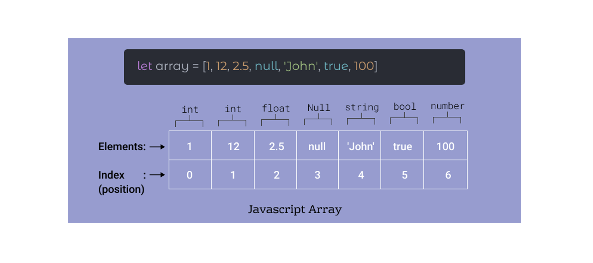

<h1 align="center">
<br>
  <br>
    
    <br>
   Array
  <br><br>
</h1>
 

[](https://github.com/clarethe) [](https://github.com/clarethe?tab=followers)

The JavaScript Array class is a global object that is used in the construction of arrays; which are high-level, list-like objects and access them by a single variable.

## Create an Array

```
let fruits = ['Apple', 'Banana']

console.log(fruits.length) // 2
```

## Access an Array item using the index position

```
let first = fruits[0]                  // Apple

let last = fruits[fruits.length - 1]   // Banana

```

## Loop over an Array

```
fruits.forEach(function(item, index, array) {
  console.log(item, index)
})
```
Output:
```
Apple  0
Banana 1
```

## Add an item to the end of an Array 
**`push`** 

```
let newLength = fruits.push('Orange')    // ["Apple", "Banana", "Orange"]
```
## Remove an item from the end of an Array
**`pop`** 

```
let last = fruits.pop() // ["Apple", "Banana"]
```
It has removed "Orange" from the end.

## Remove an item from the beggining of an Array
**`shift`** 
```
let first = fruits.shift() // ["Banana"]
```
It has removed "Apple" from the front.

## Add an item to the beginning of an Array
**`unshift`** 

```
let newLength = fruits.unshift('Strawberry')  // ["Strawberry", "Banana"]
```

## Find the index of an item in the Array
**`indexOf`** 

```
fruits.push('Mango')    // ["Strawberry", "Banana", "Mango"]

let pos = fruits.indexOf('Banana')  
```

Output:

```
1
```
## Remove an item by index position
**`splice`** 

```splice(start, deleteCount, item1, item2, itemN)```

```start``` : The index at which to start changing the array
```deleteCount (Optional)``` : integer indicating the number of elements in the array to remove from start
```item1, item2, ... (Optional)``` :  The elements to add to the array, beginning from start. If you do not specify any elements, splice() will only remove elements from the array.


```
let removedItem = fruits.splice(pos, 1) // ["Strawberry", "Mango"]
```
It has removed "Banana" from the array.

+splice info [here](https://developer.mozilla.org/en-US/docs/Web/JavaScript/Reference/Global_Objects/Array/splice)  

## Copy an Array
**`slice`** 

This is how to make a copy:
```
let shallowCopy = fruits.slice() // ["Strawberry", "Mango"]
``````

+info [here](https://developer.mozilla.org/en-US/docs/Web/JavaScript/Reference/Global_Objects/Array)  


## Accessing array elements

JavaScript arrays are zero-indexed. The first element of an array is at index 0, and the last element is at the index value equal to the value of the array's length property minus 1.

Using an invalid index number returns ```undefined```.

```
let array = ['this is the first element', 'this is the second element', 'this is the last element']

console.log(array[0])                   // logs 'this is the first element'
console.log(array[1])                   // logs 'this is the second element'
console.log(array[array.length - 1])    // logs 'this is the last element'
```