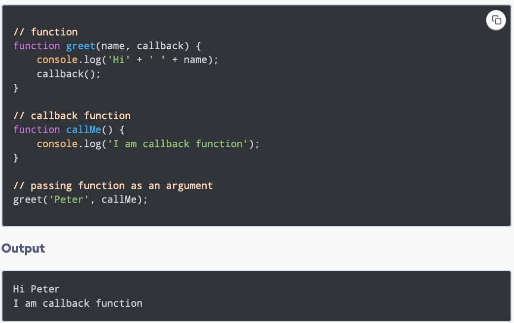
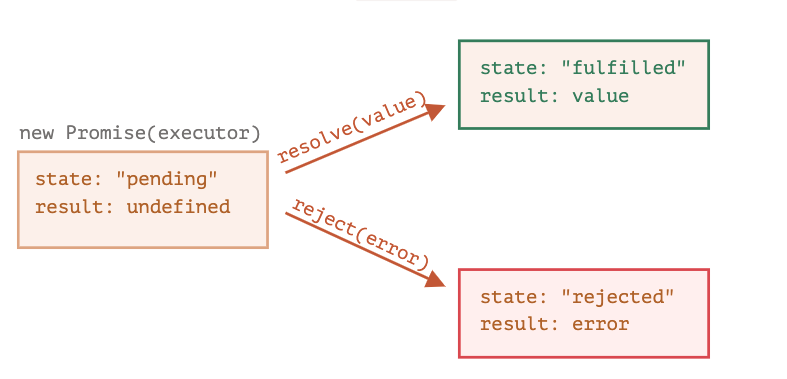
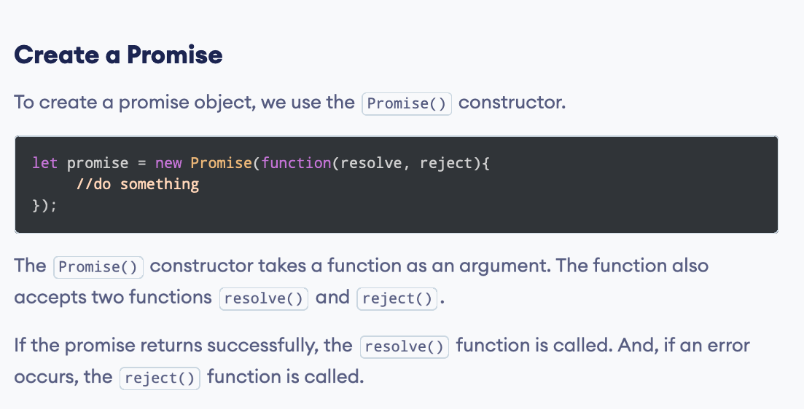
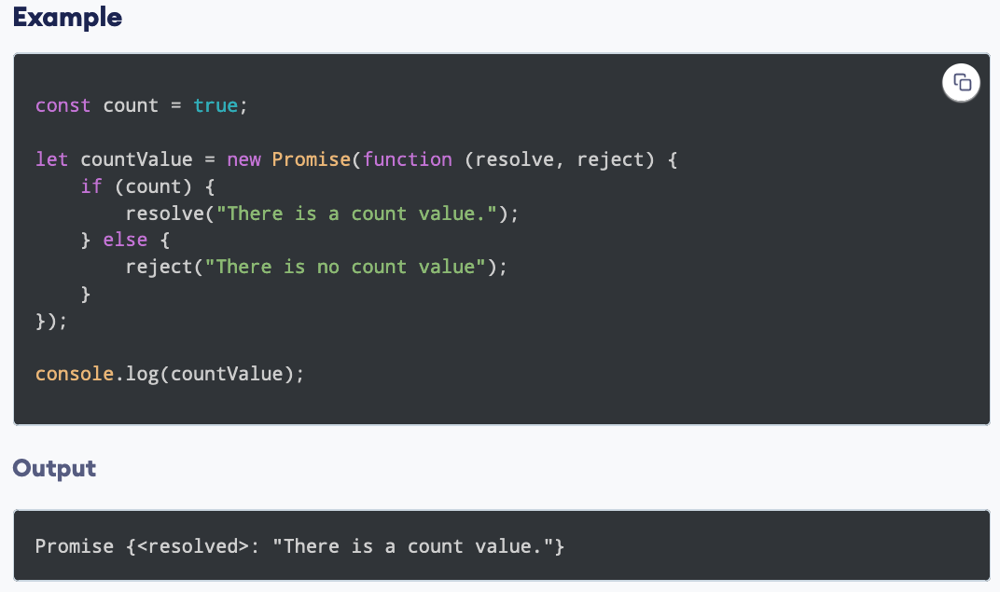
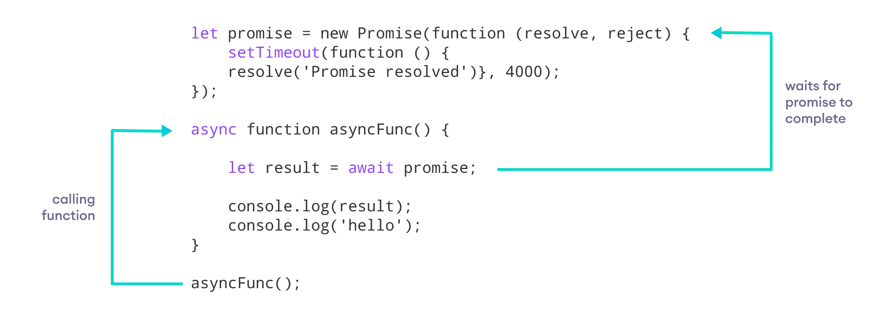

<h1 align="center">
<br>
  <br>
    <br>
    Asynchronous
  <br><br>
</h1>
 

[](https://github.com/clarethe) [](https://github.com/clarethe?tab=followers)
 
**`Synchronous`**  = happens at the same time 
<br>

**`Asynchronous`**  = doesn't happen at the time


## To schedule the execution of a function in a specific time:

Let's use: 

```
functJavaScript Promise Chainingion greet() {
    console.log('Hello world');
}
```

The **`setTimeout()`** method executes a block of code after the specified time 

```
setTimeout(greet, 3000);  
console.log('This message is shown first');
```

Output:

```
This message is shown first 
Hello world  //After 3 sec
```

The **`setInterval()`** method repeats a block of code at every given timing event:

```
setInterval(greet, 1000);
```
Output:

```
Hello world    //Every 1 sec
Hello world
Hello world
Hello world
Hello world
....
```

## Callback function:

This function that is passed as an **`argument `** inside of another function is called a callback function.

**`Note:`** The callback function is helpful when you have to wait for a <b>result that takes time </b> (you can then execute another function call).
For example, wait the data coming from a server! 

For example:
 
 

The **`callMe()`**  function is a callback function passed as a parameter on **`greet() `** 

## Promise:

Promises are similar to **`callback functions `** in a sense that they both can be used to handle asynchronous tasks.
Their differences can be summarized in the following points:

- The syntax is user-friendly and easy to read
- Error handling is easier to manage

A promise may have one of three states:

- Pending           
- Fulfilled         
- Rejected  

 
 
<br>
 
<br>

You can perform an operation after a promise is resolved using methods:

- **`then()`** - is used with the callback when the promise is successfully ```fulfilled``` or resolved

- **`catch()`** - is used with the callback when the promise is rejected or if an ```error occurs```

- **`finally()`** - is executed always<br> 

<br>

+[Examples](https://www.programiz.com/javascript/promise)

## Async/await:

The **`async`** keyword represents that the function is asynchronous and it will return a  **`promise`**

```
async function name(parameter1, parameter2, ...paramaterN) {
    // statements
}
```

The **`await`**  pauses the async function until the promise returns a result (resolve or reject) value:

```
let result = await promise;
```
**`Note:`** You can use await ONLY inside of async functions!
<br>
 

Output:

```
Promise resolved
hello
```

In the above program, a Promise object is created and it gets resolved after 4000 milliseconds.

Hence, ```hello``` is displayed only after promise value is available to the result variable. If there was no await it would be shown before!

<b>Benefits of Using async Function: </b>

- The code is more readable than using a callback or a promise

- Error handling is simpler   ```catch()```,  ```try/catch block```   +[More](https://www.programiz.com/javascript/async-await)

- Debugging is easier
 