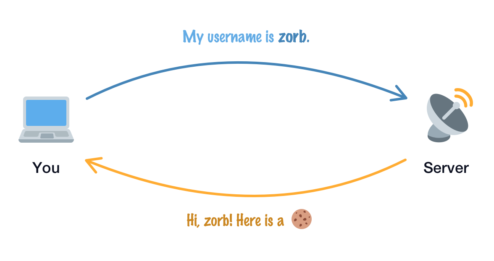
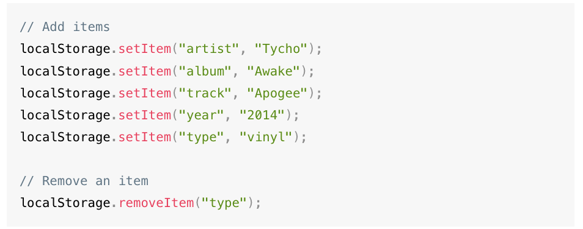
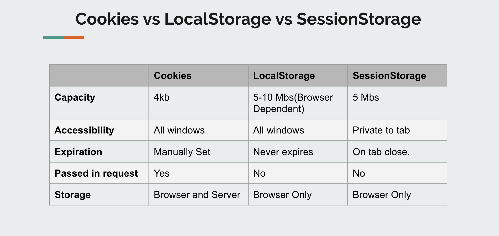

<h1 align="center">
<br>
  <br>
    <br>
    Storing data in the browser
  <br><br>
</h1>
 

[](https://github.com/clarethe) [](https://github.com/clarethe?tab=followers)
 
## Cookies

It's just some text-based information. This information has a structure made up of a series of  **`key`** and value **`pairs`**.


- ```document.cookie``` provides access to cookies

- ```expires```  sets the cookie expiration time

- ```secure```  makes the cookie HTTPS-only

- ```domain=site.com```   by default a cookie is visible on the current domain only

Cookies solve this remembering problem our servers have quite nicely and it will contain the right level of details to help the server identify us:


 

## LocalStorage, SessionStorage  

The idea behind ```web storage``` is to make storing and retrieving values very simple on the  **`client-side `** (not server)

<p>Example:</p>
 

## Which should you use? 
This decision depends strongly on what you want to achieve. But there are few tips to help you decide:

- If you want a <b> page to always </b> (in different instances and tabs) know of something, 
  sessionStorage would be a wrong choice. Rather, localStorage is your friend
  <br>
- If you <b>server doesn't need to know</b> of any local data you want to save, 
  saving in cookies may not be the best choice
  
- If the <b>server needs to know</b> about a saved data, cookie is your goto!

 