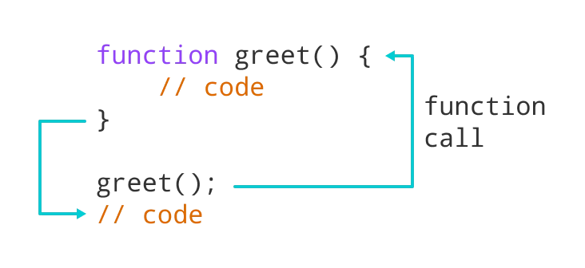
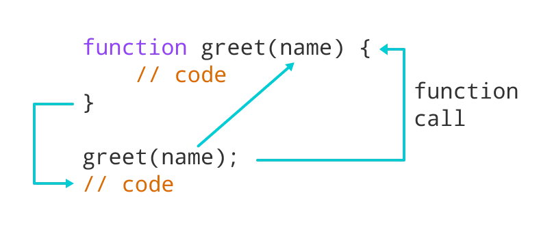
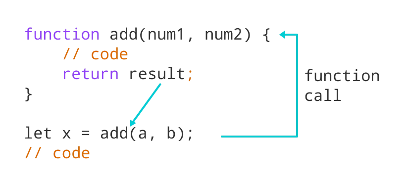
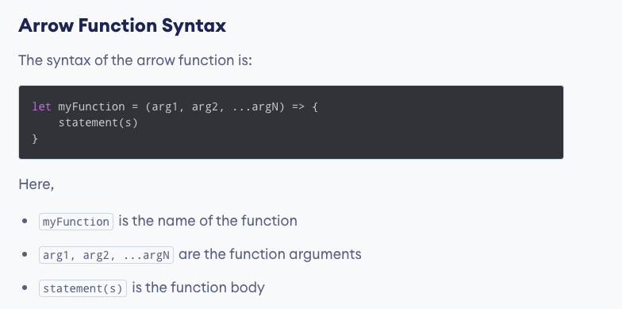
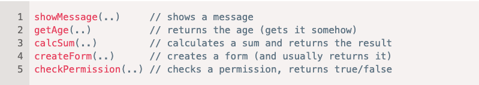

<h1 align="center">
<br>
  <br>
    <br>
    Functions
  <br><br>
</h1>
 

[](https://github.com/clarethe) [](https://github.com/clarethe?tab=followers)
 
A function is a block of code that performs a specific task. Suppose you need to create a program to create a circle and color it. You can create two functions to solve this problem:

- a function to draw the circle
- a function to color the circle

Dividing a complex problem into smaller chunks makes your program easy to understand and reusable.

## Declaring a function 

```
// declaring a function named greet()
function greet() {
    console.log("Hello there");
}
```

## Calling a Function

```
// function call
greet();
```



## Function Parameters
A **`parameter`** is a value that is passed when declaring a function. And when the function is called, the value passed is called **`argument`**.



## Function Return
The **`return`** statement can be used to return the value to a function call and denotes that the function has ended. Any code after return is not executed.
If nothing is returned, the function returns an ```undefined``` value.



## Function Expressions

In Javascript, functions can also be defined as expressions. For example:

```
// program to find the square of a number
// function is declared inside the variable

let x = function (num) { return num * num };
console.log(x(4));

// can be used as variable value for other variables

let y = x(3);
console.log(y)
```

Output:

```
16
9
```

**`Note:`** In ES2015, JavaScript expressions are written as arrow functions 

## Arrow Functions

Arrow function is one of the features introduced in the ES6 version of JavaScript. 
It allows you to create functions in a cleaner way compared to regular functions. 

For example: 

```
// function expression
let x = function(x, y) {
   return x * y;
}
```


```
// using arrow functions
let x = (x, y) => x * y;
```
 

 ## Naming a function

 Functions are actions. So their name is usually a verb. It should be brief, as accurate as possible and describe what the function does:

**`"get…`** – return a value,
**`"calc…"`** – calculate something,
**`"create…"`**  – create something,
**`"check…"`** – check something and return a boolean, etc,
**`"show…"`** – show something
 
  