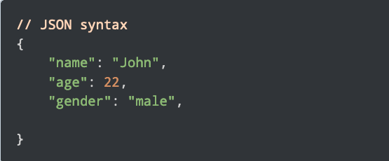
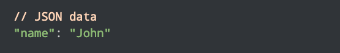
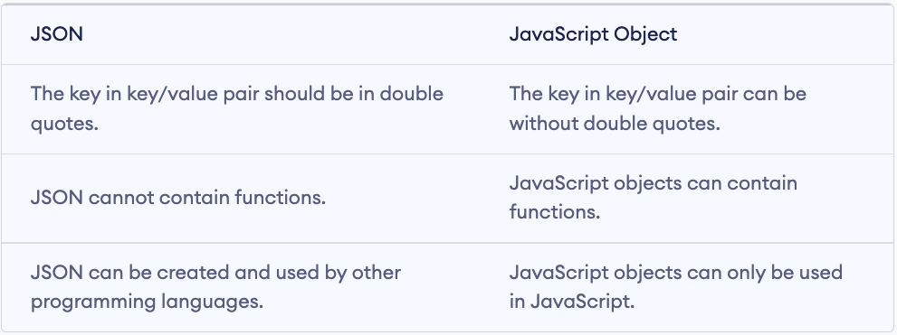
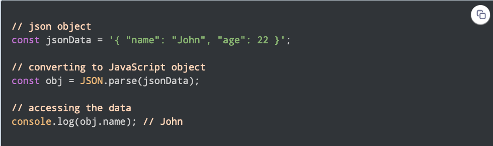
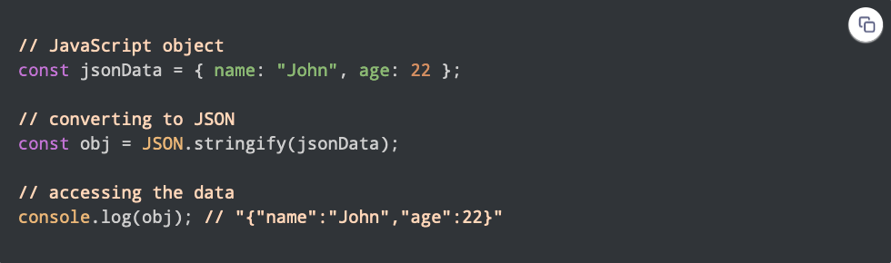
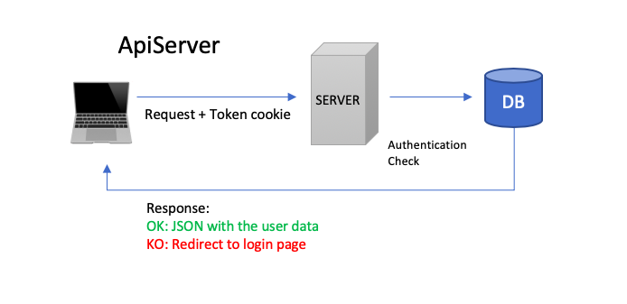

<h1 align="center">
 
 
What is a JSON?
 
</h1>
 
 

**`JSON`** stands for Javascript Object Notation. It's a text-based data format that is used to **`store`** and **`transfer`** data

For example:

It consists of **`key/value`** pairs similar to JS object properties: 

 

## JavaScript Objects VS JSON

 

## Converting JSON to JavaScript Object

**`JSON.parse()`** - converts JSON data to a JS object

 

## Converting JavaScript Object to JSON

**`JSON.stringify()`** - converts JS object to a JSON data

 

## Use of JSON

- Most commonly used format for transmitting data from a server to a client and vice-versa
- Very easy to parse and use
- Fast to access and manipulate  
- Independent language (It's used for other programming languages) 

 