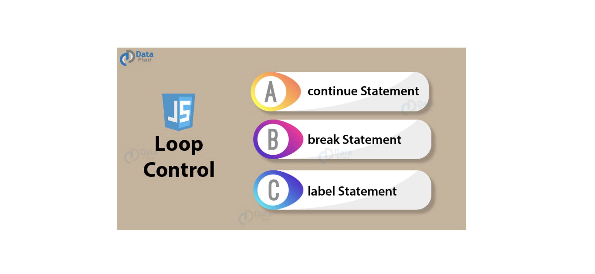

<h1 align="center">
<br>
<br>
Loops and iteration
<br>
<br>
<br>
</h1>
 

[](https://github.com/clarethe) [](https://github.com/clarethe?tab=followers)

Loops offer a quick and easy way to do something repeatedly. There are many different kinds of loops and they repeat an action some number of times. (Note that it's possible that number could be zero!)

## for  

A for loop repeats until a specified condition evaluates to ```false```

```
for ([initialExpression]; [conditionExpression]; [incrementExpression])
  statement
```

**`initialExpression`** 
If any, is executed and initializes one or more loop counter.


**`conditionExpression`** 
It is evaluated. If the value is ```true``` the loop statements execute and if it is ```false```, the for loop terminates.

**`statement`** 
It is executed. To execute multiple statements use a block  ({ ... })  

For example:

```
for (let step = 0; step < 5; step++) {
  // Runs 5 times, with values of step 0 through 4.
  console.log('Walking east one step');
}
```
## for...in
The for...in statement iterates over property names

```
for (variable in object)
  statement
```

For example:

```
const object = { a: 1, b: 2, c: 3 };

for (const property in object) {
  console.log(`${property}: ${object[property]}`);
}
```
Output:

```
a: 1
b: 2
c: 3
```
## for...of
The for...of statement iterates over property values

```
for (variable of object)
  statement

```

For example:

```
const array = [ 'a', 'b', 'c' ];

for (const element of array) {
  console.log(element);
}
```
Output:

```
a
b
c
```


## do...while
Statement is always executed once before the condition is checked. If condition is ```true``` the statement executes again condition and if it is ```false```, execution stops.

```
do 
   statement
while (condition);
```

## while

A while statement executes its statements as long as a specified condition evaluates to ```true```. 

```
while (condition) 
  statement
```



**`label`** 
A label provides a statement with an identifier that lets you refer to it elsewhere in your program.

```
label :
   statement
```
For example, you can use a label to identify a loop, and then use the ```break``` or ```continue``` statements to indicate whether a program should interrupt the loop or continue its execution.

**`break`** 
Use the break statement to terminate a loop, switch, or in conjunction with a labeled statement.

```
break;
break [label];
```
**`continue`** 
The continue statement can be used to restart a while, do-while, for, or label statement.

```
continue [label];
```