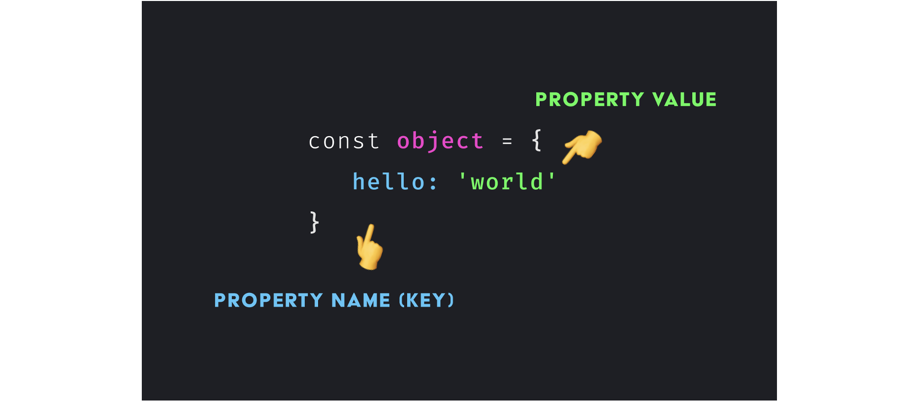
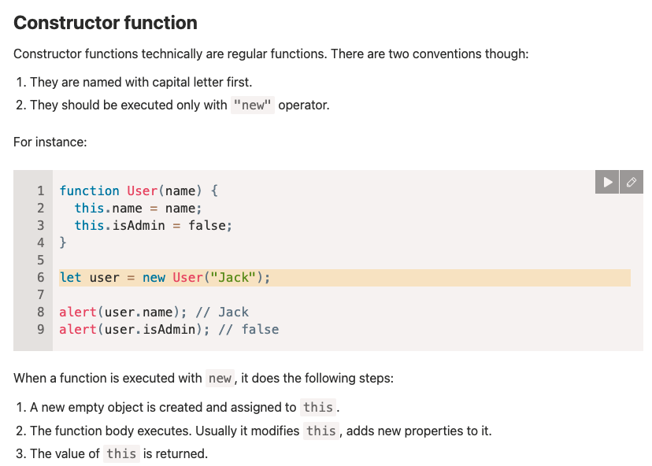

<h1 align="center">
<br>
  <br>
    
    <br>
   JavaScript Objects
  <br><br>
</h1>
 

[](https://github.com/clarethe) [](https://github.com/clarethe?tab=followers)

In JavaScript, an object is an unordered collection of key-value pairs. Each key-value pair is called a property.

The **`key`** of a property can be a ```string``` and the **`value`** of a property can be any valid value e.g., a ```string```, a ```number```, an ```array```, and even a ```function```.

When a function is a property of of an object, it’s often called a **`method`**.

To create an object with properties, you use the ```key:value``` within the curly braces. For example, the following creates a new ```person``` object:

```
let person = {
    firstName: 'John',
    lastName: 'Doe'
};
```

The person object has two properties ```firstName``` and ```lastName``` with the corresponding values ```'John'``` and ```'Doe'```.

When an object has multiple properties, you use a comma ```(,)``` to separate them like the above example.


## Accessing properties

To access a property of an object, you use one of two notations: (1) the dot notation and (2) array-like notation.

The following illustrates how to use the **` (1) dot notation`**  to access a property of an object:

```
objectName.propertyName
```

This example creates a person object and shows the ```first name``` and ```last name``` to the console:

```
let person = {
    firstName: 'John',
    lastName: 'Doe'
};

console.log(person.firstName);
console.log(person.lastName);
```

The following illustrates how to access the value of an object’s property via the **` (2) array-like notation`**:

```
objectName['propertyName']
```
When a property name contains spaces, you need to place it inside quotes. For example, the following ```address``` object has the 'building no' as a property:

```
let address = {
    'building no': 3960,
    street: 'North 1st street',
    state: 'CA',
    country: 'USA'
};
```

To access the ```'building no'``` property, you need to use the array-like notation:

```
address['building no'];
```

If you use the dot notation, you’ll get an error:
```
address.'building no';  //SyntaxError: Unexpected string
```
 

+info [here](https://www.javascripttutorial.net/javascript-objects/)  

## Modifying the value of a property

To change the value of a property, you use the assignment operator ```(=)```. For example:

```
let person = {
    firstName: 'John',
    lastName: 'Doe'
};

person.firstName = 'Jane';

console.log(person);   //Output: { firstName: 'Jane', lastName: 'Doe' }
```
In this example, we changed the value of the ```firstName``` property of the person object from ```'John'``` to ```'Jane'```.

## Adding a new property to an object

You can add a property to an object after object creation.

The following statement adds the ```age``` property to the person object and assigns 25 to it:

```
person.age = 25;
```

## Deleting a property of an object

To delete a property of an object, you use the **`delete`**  operator. 

The following example removes the ```age``` property from the person object:

```
delete person.age;
```

If you attempt to access the ```age``` property again, you’ll get an ```undefined``` value.

## Checking if a property exists

To check if a property exists in an object, you use the **`in`**  operator:

```
propertyName in objectName
```

The in operator returns ```true``` if the ```propertyName``` exists in the ```objectName```.
For example:

```
let employee = {
    firstName: 'Peter',
    lastName: 'Doe',
    employeeId: 1
};

console.log('address' in employee);       //Output: false
console.log('employeeId' in employee);    //Output: true

```

## Constructor, operator "new"

The regular  **`{...} `** syntax allows to create one object. But often we need to create many similar objects, like multiple users or menu items and so on.

That can be done using constructor functions and the **`new`** operator.




## Iterating over properties of an object using for...in loop

To iterate over all properties you use the **`for...in `**  loop.

```
for(let key in object) { 
    // ...
}
```
For example:

```
let website = {
    title: 'JavaScript Tutorial',
    url: 'https://www.javascripttutorial.net',
    tags: ['es6', 'javascript', 'node.js', 'reactjs', 'react native']
};

for (const key in website) {
    console.log(key);
}
```
Output:

```
'title' 
'url'
'tags'
```

