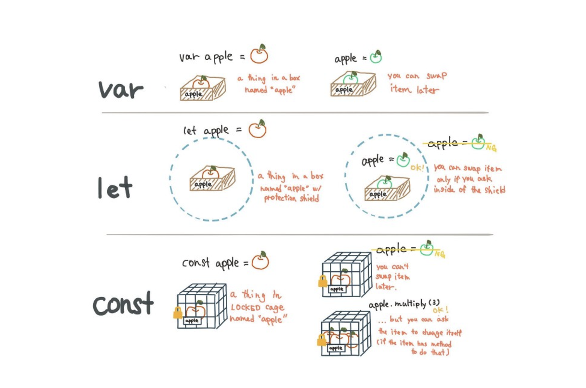
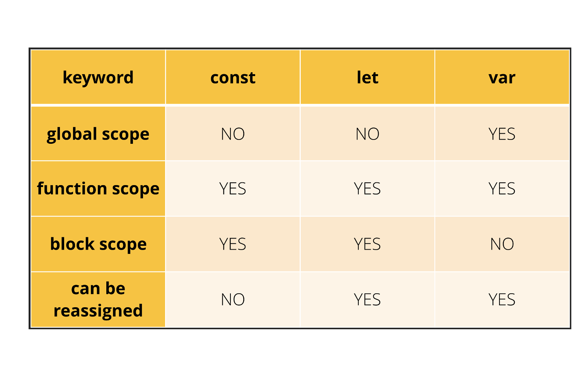

<h1 align="center">
<br>
  
  <br>
    <br>
   Declaration of variables VAR, LET, CONST  
  <br><br>
</h1>
 

[](https://github.com/clarethe) [](https://github.com/clarethe?tab=followers)
 

## VAR

Here's how you can declare a **`var`** variable with the identifier ```myVariable1``` or ```myVariable2```:
```
var myVariable1 = initialValue;
// or
var myVariable2;
```

The variable ```myVariable1``` is declared and initialized right away with an initialValue, which can be any kind of expression: literal, function call, etc.

The variable ```myVariable2``` is declared, however doesn't have an initial value. By default, JavaScript considers uninitialized variables as having the special value ```undefined```.

In the following code snippet:

```
var city = 'Gotham';
var name;
```

The  **`var`**  variable ```city``` is declared and initialized with the string literal 'Gotham'. ```name``` variable also has been defined, but it wasn't initialized.

After the declaration and optional initialization, you can access the **`var`** variable value just by using its name (or identifier):

```
var city = 'Gotham';
console.log(city);                  // logs 'Gotham'
console.log(`Welcome to ${city}!`); // logs 'Welcome to Gotham!'
var name;
console.log(name); // logs undefined
```

```name``` variable, while being declared, it is not yet initialized so it has an undefined value.

Same as with **`let`** variables, you can easily reassign **`var`** variables:

```
var city = 'Gotham';
city = 'New York';
console.log(city); // logs 'New York'
```

In contrast to **`const`** and  **`let`**, the scope of the **`var`** variables is defined only by the function body:

```
function welcomeTo() {
  // Function scope
  var city = 'Gotham';
  console.log(`Welcome to ${city}!`); // logs 'Welcome to Gotham!'
}
console.log(`Welcome to ${city}!`); // throws ReferenceError
welcomeTo();
```

A code block doesn't create a scope for **`var`** variables:

```
if (true) {
  // Code block scope
  var city = 'Gotham';
  console.log(city); // logs 'Gotham'
}
console.log(city); // logs 'Gotham'
```

Normally, you won't access a **`var`** variable before the declaration statement. But if you do, JavaScript won't throw a reference error, but rather evaluate the variable to ```undefined```:

```
console.log(city); // logs undefined
var city = 'Gotham';
```
 

## LET

Here's how you can declare a **`let`** variables with the identifiers ```myVariable1``` and ```myVariable2```:

```
let myVariable1 = initialValue;
// or
let myVariable2;
```

The variable ```myVariable1``` is declared and initialized right away with an initialValue.

The variable ```myVariable2``` is declared, however doesn't have an initial value. By default, JavaScript considers uninitialized variables having the special value undefined.

In the following code snippet:

```
let villain = 'Joker';
let name;
```

The  **`let`** variable named ```villain``` is declared and initialized with the string literal 'Joker'. ```name``` variable also has been defined, but it wasn't initialized.

After the declaration and initialization, you can access the **`let`** variable value just by writing the identifier:

```
let villain = 'Joker';
console.log(villain);              // logs 'Joker'
console.log(`Hello, ${villain}!`); // logs 'Hello, Joker!'
let name;
console.log(name); // logs undefined
```

```name``` variable, while being declared, isn't initialized so it has an ```undefined``` value.

You can <b>easily update the value </b> of a  **`let`**  variable, a thing you cannot do with **`const`** variables - and that's the main difference between them.

## CONST

Here's how you can declare a const variable with the identifier ```myConstVariable```:

```
const myConstVariable = initialValue;
```

The variable ```myConstVariable``` is initialized right away with an initialValue, which can be any expression that evaluates to a value.

Examples of initial values are literals (numbers 1, strings 'My Initial Value'), other variables, function calls.

For example the statement:

```
const hero = 'Batman';
```

Declares a **`const`**  variable with the identifier hero initialized with the string literal 'Batman'.

What's also specific to **`const`**  variables (contrary to **`let`**  and **`var`**  variables described below) is that you have to assign the initial value:

```
const hero; // SyntaxError: Missing initializer in const declaration
```

After the declaration and initialization, you can access the variable value just by using its name (aka identifier):

```
const hero = 'Batman';
console.log(hero);              // logs 'Batman'
console.log(`Hello, ${hero}!`); // logs 'Hello, Batman!'
```

What distinguishes  **`const`**  variables from **`let`** and **`var`** is that you cannot assign a new value to a **`const`**  variable:

```
const hero = 'Batman';
hero = 'Joker'; // TypeError: Assignment to constant variable
```

The code block and a function body create a scope for **`const`**  variables. The concept of scope defines the limits where the variable is accessible.

From the usage perspective, you should use **`const`** variables as read-only that you don't plan to reassign.




 